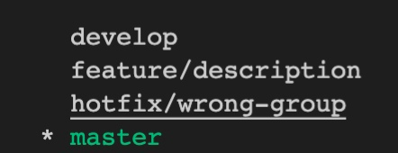
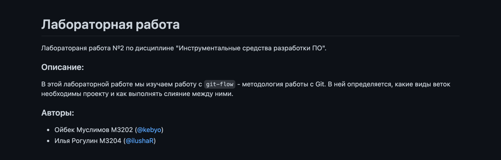
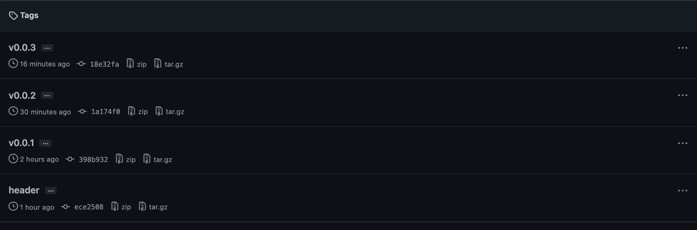
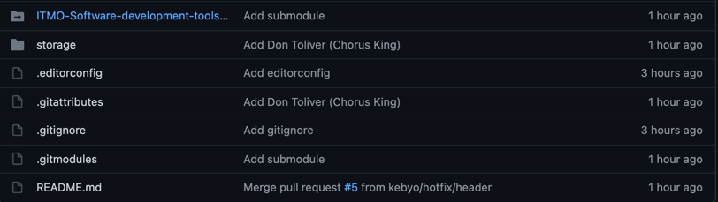

# Отчет по лабораторной работе №2

### Первый студент заводит репозиторий, второй делает в нее Pull request.

1. Репозиторий: https://github.com/kebyo/lab2/tree/master
2. Pull Request: https://github.com/kebyo/lab2/pull/1

### Создание веток по модели GitFlow - https://danielkummer.github.io/git-flow-cheatsheet/index.ru_RU.html - Обязательное наличие веток фич, релиз, девелоп, хот фикс.

1. Установка:

   `brew install git-flow-avh`


2. Инициализация:
   
   `git flow init`


3. Ветки:



### В репозитории обязательно оформлен README.md

    
### Наличие тегов
Использовали команды:
* `git flow release start <version>`
* `git flow release finish <version>`
* `git flow release publish <version>`




### Submodules

Использовали команду:

`git submodule add https://github.com/kebyo/ITMO-Software-development-tools`



Появился конфиг `.gitmodules`:


```
[submodule "ITMO-Software-development-tools"]
	path = ITMO-Software-development-tools
	url = https://github.com/kebyo/ITMO-Software-development-tools
```

### LFS:
**Git LFS (Large File Storage**) — это расширение, заменяющее большие файлы на текстовые ссылки в Git, в то время как их содержимое файлов сохраняется на удаленных серверах GitHub Enterprise

```
*.mp3 filter=lfs diff=lfs merge=lfs -text
```

### Справочник по командам:
1. `git pull` 

   Команда git pull работает как комбинация команд git fetch и git merge, т.е. Git вначале забирает изменения из указанного удалённого репозитория, а затем пытается слить их с текущей веткой.
2. `git push` 

   Команда git push используется для установления связи с удалённым репозиторием, вычисления локальных изменений отсутствующих в нём, и собственно их передачи в вышеупомянутый репозиторий. Этой команде нужно право на запись в репозиторий, поэтому она использует аутентификацию.
3. `git status`
   
    Команда git status показывает состояния файлов в рабочей директории и индексе: какие файлы изменены, но не добавлены в индекс; какие ожидают коммита в индексе. Вдобавок к этому выводятся подсказки о том, как изменить состояние файлов.
4. `git add`

   Команда git add добавляет содержимое рабочей директории в индекс (staging area) для последующего коммита.По умолчанию git commit использует лишь этот индекс, так что вы можете использовать git add для сборки слепка вашего следующего коммита.
5. `git fetch `

   Команда git fetch связывается с удалённым репозиторием и забирает из него все изменения, которых у вас пока нет и сохраняет их локально.
6. `git checkout`

   Команда git checkout используется для переключения веток и выгрузки их содержимого в рабочую директорию
7. `git branch`

   Умеет перечислять ветки, создавать новые, удалять и переименовывать их.
8. `git submodule`

   оманда git submodule используется для управления вложенными репозиториями. Например, это могут быть библиотеки или другие, используемые не только в этом проекте ресурсы. У команды submodule есть несколько под-команд — add, update, sync и др. — для управления такими репозиториями.
9. `git reset`
   
   Команда git reset, как можно догадаться из названия, используется в основном для отмены изменений. Она изменяет указатель HEAD и, опционально, состояние индекса. Также эта команда может изменить файлы в рабочей директории при использовании параметра --hard, что может привести к потере наработок при неправильном использовании
10. `git rm`

    Команда git rm используется в Git для удаления файлов из индекса и рабочей директории. Она похожа на git add с тем лишь исключением, что она удаляет, а не добавляет файлы для следующего коммита.
11. `git commit`
    
    Команда git commit берёт все данные, добавленные в индекс с помощью git add, и сохраняет их слепок во внутренней базе данных, а затем сдвигает указатель текущей ветки на этот слепок.
12. `git fetch`

    Команда git fetch связывается с удалённым репозиторием и забирает из него все изменения, которых у вас пока нет и сохраняет их локально.


### Авторы:
* Ойбек Муслимов М3202 ([@kebyo](https://github.com/kebyo))
* Илья Рогулин М3204 ([@ilushaR](https://github.com/ilushaR))
